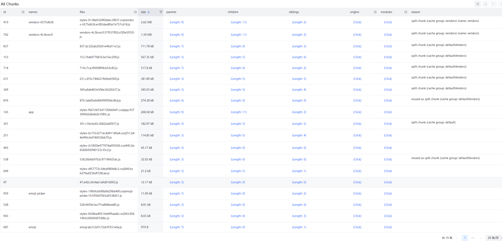
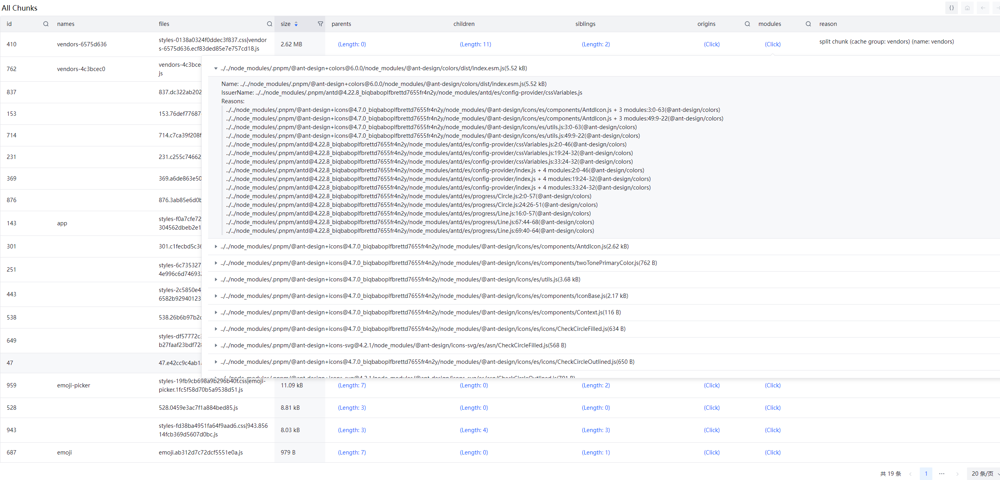

# webpack-stats-viewer

[简体中文](./README.zh.md)

A website for checkout webpack stats info.

Many same webpack analyzer tools can show summary, but as a developer, when i try go deep into, and think why those file bundled into those chunk, those tools make me powerless, because of i cannot get more detail. So i develop this tool, no magic, just plain data. I think i need it.

**This is for in-depth study of webpack chunks composition and for deep website performance optimization**

## Feature

- Easy to read
  - No more magic. Just show you more detail
- Found why bundle it
  - By `modules`, we can checkout everyone, No lost.
- Single file
  - Record a static report which can read it later.
- Website and Plugin
  - Ease to use.
  
## Usage in webpack

```bash
npm install webpack-stats-viewer-plugin
```

*webpack.config.js*:
```ts
import { WebpackStatsViewerPlugin } from 'webpack-stats-viewer-plugin';

export default {
  // ...
  plugins: [
    // ...
    new WebpackStatsViewerPlugin(),
  ]
  // ...
}
```

## About webpack stats

[https://webpack.js.org/api/stats/](https://webpack.js.org/api/stats/)

## Screenshot





## Online Viewer

- [Online Viewer](https://webpack-stats-viewer.moonrailgun.com/) (you should generate `stats.json` by yourself)
