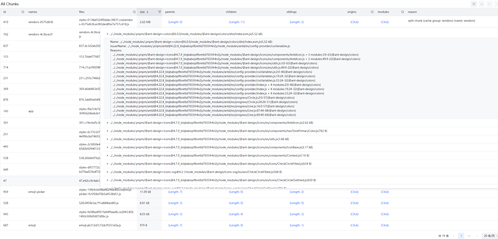

# webpack-stats-viewer

一个用于检查 `webpack` 统计信息的工具。

许多同类的 `webpack` 分析器工具可以显示摘要，但是作为开发人员，当我尝试深入研究并思考为什么将那些文件捆绑到这些块中时，这些工具让我感到无力，因为我很难看到更多的细节。所以我开发了这个工具，没有花里胡哨的魔法，作为开发者我需要的仅仅是更多的细节。我想我需要它。

**这是为了深入研究 webpack chunks 构成以及用于深度网站性能优化而打造的**

## 特征

- 易于阅读
  - 没有花里胡哨的各种图表。只是展示更多实用的细节
- 找到为什么一个文件被引入(以及包含了那些)
  - 通过`modules`，我们可以获得更加详细的细节，不丢失任何内容
- 单个HTML文件输出
  - 记录静态报告，便于比较/存储/归档
- 提供在线网站与 `webpack` 插件
  - 易于使用

## 在 webpack 中使用

```bash
npm install webpack-stats-viewer-plugin
```

*webpack.config.js*:
```ts
import { WebpackStatsViewerPlugin } from 'webpack-stats-viewer-plugin';

export default {
  // ...
  plugins: [
    // ...
    new WebpackStatsViewerPlugin(),
  ]
  // ...
}
```

## 关于 webpack 统计信息

[https://webpack.js.org/api/stats/](https://webpack.js.org/api/stats/)

## 界面预览




## 使用在线版本

- [Online Viewer](https://webpack-stats-viewer.moonrailgun.com/) (你应该自己生成`stats.json`)

## 开源地址

[https://github.com/moonrailgun/webpack-stats-viewer](https://github.com/moonrailgun/webpack-stats-viewer)
